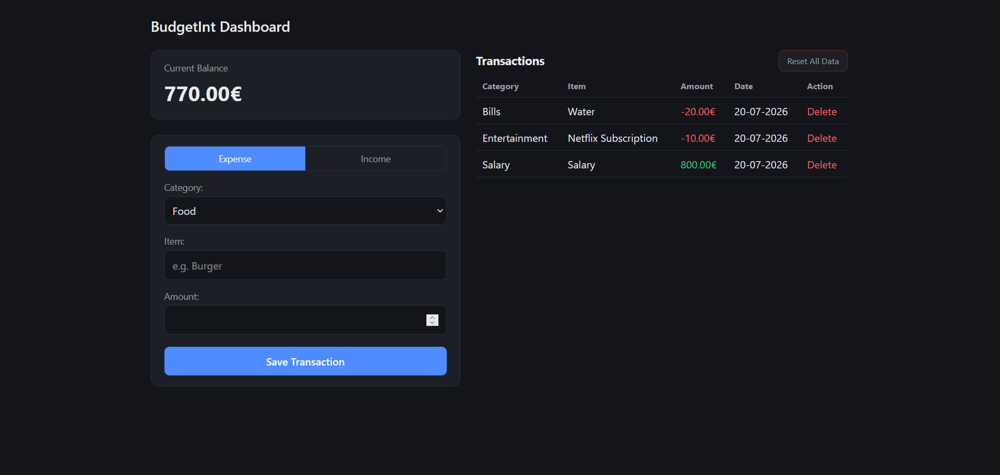

# Expense Tracker

A web app to track personal income and expenses, built with Flask and SQLite.



## Features
- Add income or expense transactions, each with its own set of categories
- Running balance, updated as you go
- Transaction history with colour-coded amounts
- Delete individual transactions, or reset the database
- Responsive two-column layout that collapses on narrow screens
- The database is created automatically on first launch

## How to run
```bash
git clone https://github.com/veseling02/expense-tracker-sqlite
cd expense-tracker-sqlite
pip install -r requirements.txt
python app.py
```
Open `http://127.0.0.1:5000` in your browser.

## Tech stack
Python, Flask, SQLite, and hand-written HTML/CSS — no frontend frameworks.

## Purpose
Built to practise Flask routing, relational databases, and building a UI from scratch without a CSS framework.
